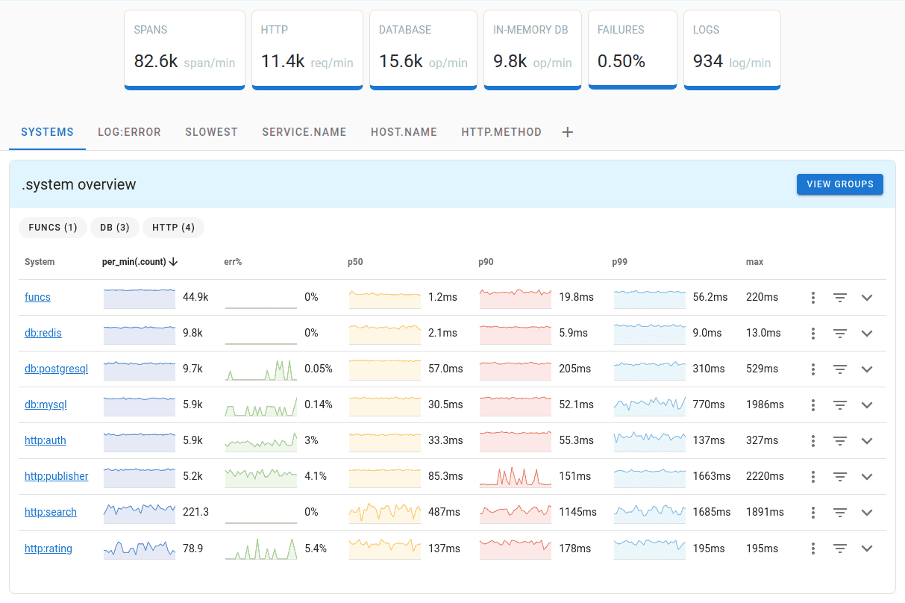
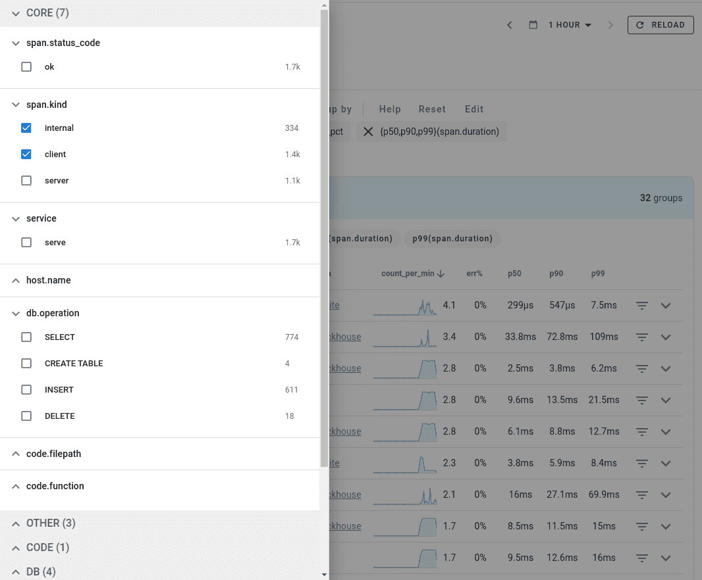

Languages: **English** | [简体中文](README.zh.md)

# Open source APM: OpenTelemetry traces, metrics, and logs

Uptrace is an [open source APM](https://uptrace.dev/get/open-source-apm.html) that supports
distributed tracing, metrics, and logs. You can use it to monitor applications and troubleshoot
issues.

Uptrace comes with an intuitive query builder, rich dashboards, alerting rules, notifications, and
integrations for most languages and frameworks.

Uptrace can process billions of spans and metrics on a single server and allows you to monitor your
applications at 10x lower cost.

Uptrace uses OpenTelelemetry framework to collect data and ClickHouse database to store it. Uptrace
also requires PostgreSQL database to store metadata such as metric names and alerts.

**Features**:

- Single UI for traces, metrics, and logs.
- SQL-like query language to [aggregate spans](https://uptrace.dev/get/querying-spans.html).
- Promql-like language to [aggregate metrics](https://uptrace.dev/get/querying-metrics.html).
- Built-in [alerts](https://uptrace.dev/get/alerting.html) with notifications via Email, Slack,
  WebHook, and AlertManager.
- Pre-built metrics dashboards.
- Multiple users/projects via YAML config.
- Single sign-on (SSO) using OpenID Connect: [Keycloak](https://uptrace.dev/get/sso/keycloak.html),
  [Google Cloud](https://uptrace.dev/get/sso/google.html), and
  [Cloudflare](https://uptrace.dev/get/sso/cloudflare.html).
- Ingestion using [OpenTelemetry](https://uptrace.dev/get/ingest/opentelemetry.html),
  [Vector](https://uptrace.dev/get/ingest/vector.html),
  [FluentBit](https://uptrace.dev/get/ingest/fluent-bit.html),
  [CloudWatch](https://uptrace.dev/get/ingest/aws-cloudwatch.html), and more.
- Efficient processing: more than 10K spans / second on a single core.
- Excellent on-disk compression: 1KB span can be compressed down to ~40 bytes.

**System overview**

**Faceted filters**

**Metrics**

**Alerts**

## Quickstart

You can try Uptrace in just a few minutes by visiting the [cloud demo](https://app.uptrace.dev/play)
(no login required) or by [running](https://github.com/uptrace/uptrace/tree/master/example/docker)
it locally with Docker.

Then follow the [getting started](https://uptrace.dev/get/get-started.html) guide.

## Help

Have questions? Get help via [Telegram](https://t.me/uptrace),
[Slack](https://join.slack.com/t/uptracedev/shared_invite/zt-1xr19nhom-cEE3QKSVt172JdQLXgXGvw), or
[start a discussion](https://github.com/uptrace/uptrace/discussions) on GitHub.

## Contributing

See [Contributing to Uptrace](https://uptrace.dev/get/contributing.html).

