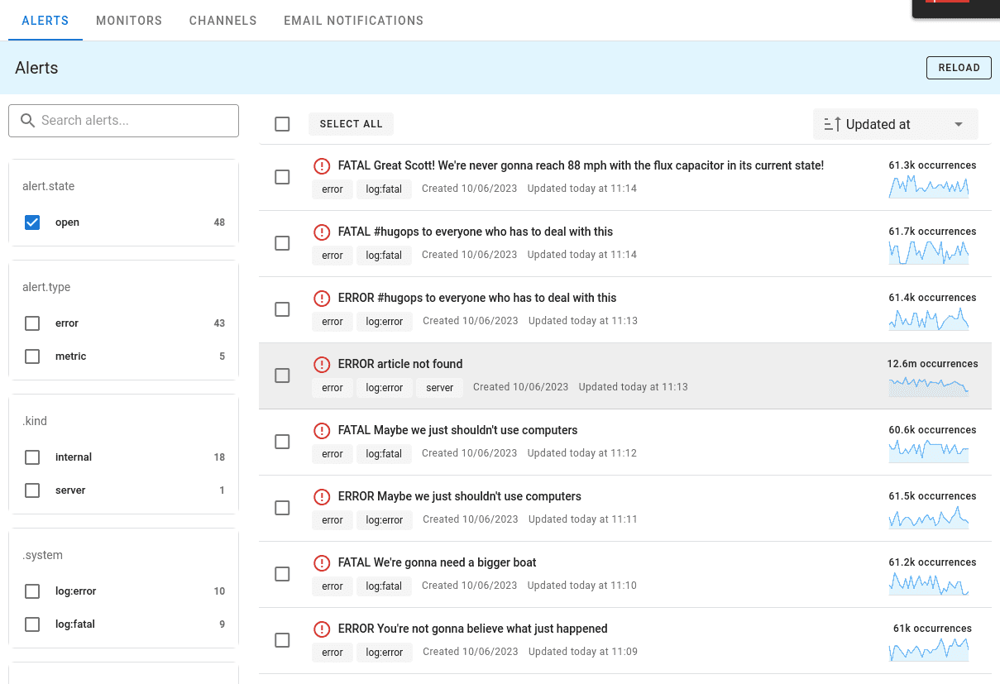

选择语言: [English](README.md) | **简体中文**

# 开源 APM：OpenTelemetry 追踪、指标和日志

Uptrace 是一种开源的 APM 工具，支持分布式跟踪、指标和日志。您使用它可以监控应用程序并设置自动报警，
可以通过电子邮件、Slack、Telegram 等方式接收通知。

Uptrace 使用 OpenTelemetry 收集数据并使用 ClickHouse 数据库存储数据。ClickHouse 是 Uptrace 的唯一依
赖。

**功能**

- 跨度(span) / 日志分组。
- 类似 SQL 风格的 span 统计。
- 类似 Promql 风格的统计和监控指标。
- 可以使用电子邮件、Slack、Telegram 等接收报警信息。
- 预绘制指标图表。
- 支持 YAML 配置多个用户和项目。
- 支持 Keycloak、Cloudflare、Google Cloud 等方式单点登录(SSO)。

**亮点**

- 统一风格的用于跟踪、指标和日志的 UI 界面。
- 高性能：单核每秒处理超过 10K span。
- 使用 ZSTD 压缩算法进行磁盘压缩，1KB span 可以压缩到 40 字节以内。
- 支持 S3 存储，能够自动将冷数据上传到 S3 或 HDD 等进行存储。
- 通过电子邮件、Slack、Telegram 等方式自动发出报警信息。

**System overview**

**Faceted filters**

**Metrics**

**Alerts**

## 快速开始

你可以通过 [docker-compose](example/docker) 示例来快速运行 Uptrace，也可以和大家一起体验
[在线 Demo](https://app.uptrace.dev/play)（无需登录）。

在 [入门指南](https://uptrace.dev/get/get-started.html) 有详细安装步奏，可以下载 Go 二进制文件或
DEB/RPM 包安装 Uptrace，额外仅需要安装 ClickHouse 数据库。

## 帮助

可以通过 [Telegram](https://t.me/uptrace),
[Slack](https://join.slack.com/t/uptracedev/shared_invite/zt-1xr19nhom-cEE3QKSVt172JdQLXgXGvw) 或
GitHub [start a discussion](https://github.com/uptrace/uptrace/discussions) 寻求帮助。

## 常见问题

**商业许可证**

[Business Source License](LICENSE) 与 Apache 2.0 相同，唯一的例外是你不能使用该代码创建云服务，也就
是不能将产品转售他人来牟利。

BSL 被 MariaDB、Sentry、CockroachDB、Couchbase 和许多其他公司采用。在大多数情况下，它是一个比 AGPL
更宽松的许可证，允许对代码进行私人修改。

三年后，该代码允许在 Apache 2.0 许可下使用。您可以了解更多关于
[BSL](https://mariadb.com/bsl-faq-adopting/) 的信息。

**我可以使用 Uptrace 监控商业或生产服务吗？**

你可以使用 Uptrace 来监控**您的**应用程序并为员工提供 Uptrace 访问权限，没有任何限制。

**为什么要使用 BSL 许可**？

我们选择 BSL 许可证的目的是允许用户使用 Uptrace 监控他们的应用程序，但禁止其他公司使用该代码创建云服
务。

我们提供自己的[监控服务](https://uptrace.dev/)，这样可以通过我们的工作获取收入来保持持续发展。

**Uptrace 是开源的吗？**

从技术上讲，BSL 许可证被归类为源代码可用，但我们在源代码开放的基础上继续使用开源的说法。这是通过搜索
引擎关键字吸引用户的手段，我们的竞争对手也是类似的做法。

**数据库模式稳定吗？**

数据库模式是稳定的，但我们仍在对数据库模式进行更改，并计划在
[ClickHouse dynamic subcolumns](https://github.com/ClickHouse/ClickHouse/pull/23932) 特性足够
[稳定](https://github.com/ClickHouse/ClickHouse/issues?q=is%3Aissue+is%3Aopen+label%3Acomp-type-object)
时，切换到该模式。

## 贡献

请参阅 [为 Uptrace 做贡献](https://uptrace.dev/get/contributing.html)。

